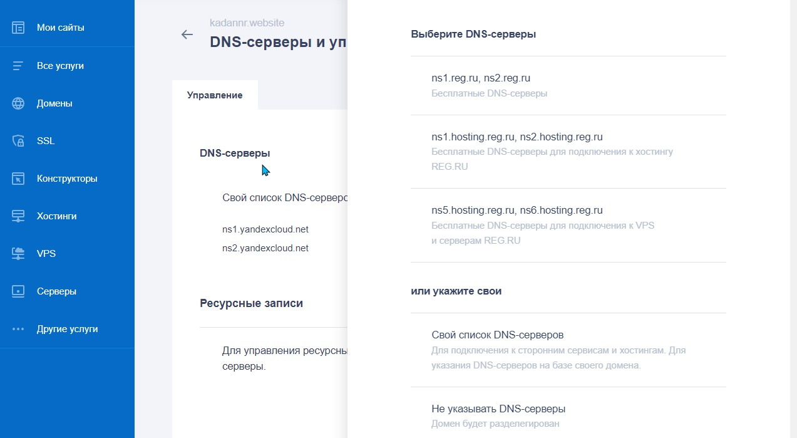
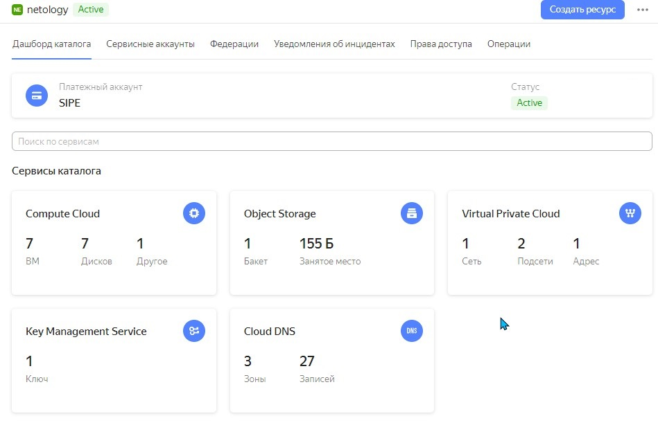
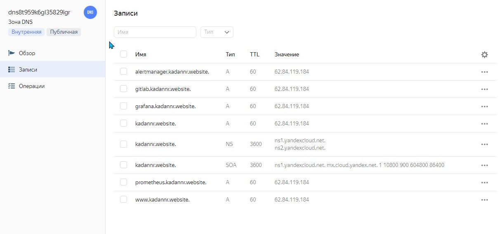
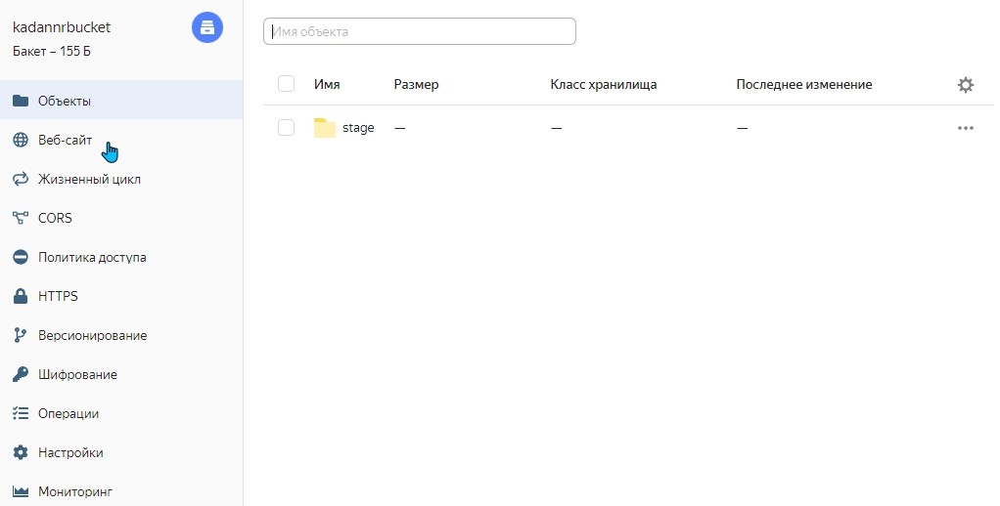
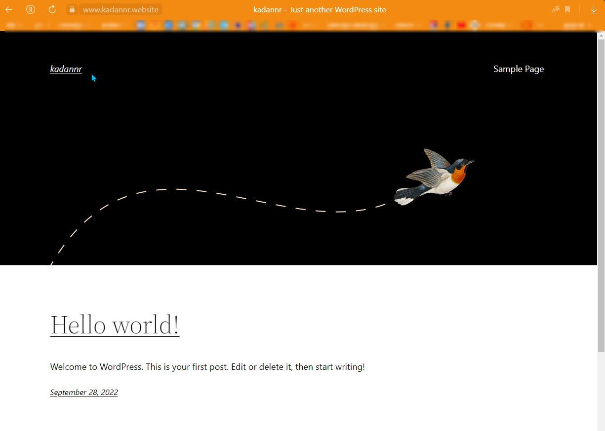
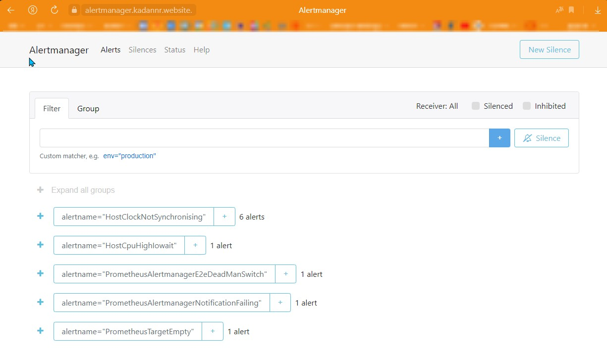
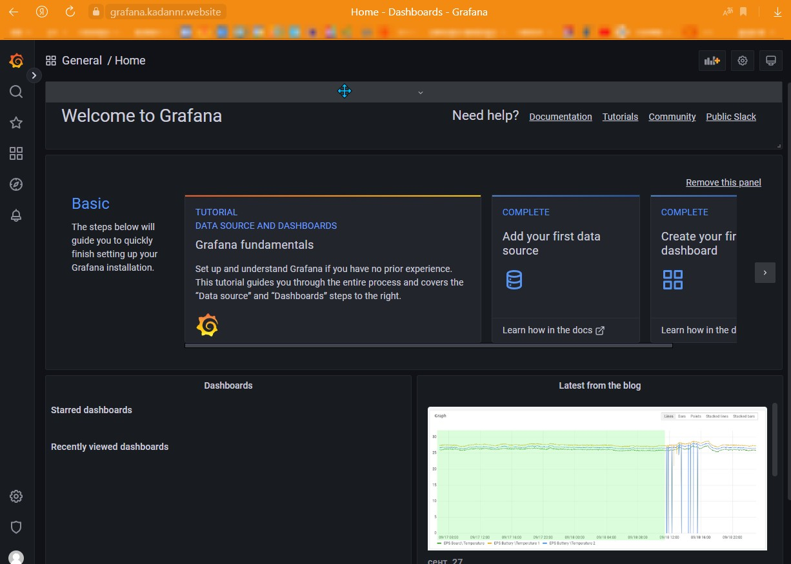

# Дипломный практикум в YandexCloud
  * [Цели:](#цели)
  * [Этапы выполнения:](#этапы-выполнения)
      * [Регистрация доменного имени](#регистрация-доменного-имени)
      * [Создание инфраструктуры](#создание-инфраструктуры)
          * [Установка Nginx и LetsEncrypt](#установка-nginx)
          * [Установка кластера MySQL](#установка-mysql)
          * [Установка WordPress](#установка-wordpress)
          * [Установка Gitlab CE, Gitlab Runner и настройка CI/CD](#установка-gitlab)
          * [Установка Prometheus, Alert Manager, Node Exporter и Grafana](#установка-prometheus)


---
---
## Цели:
0. Файловая структура
1. Зарегистрировать доменное имя (любое на ваш выбор в любой доменной зоне).
2. Подготовить инфраструктуру с помощью Terraform на базе облачного провайдера YandexCloud.  
  2.0  
  ...  
  2.5
3. Настроить внешний Reverse Proxy на основе Nginx и LetsEncrypt.
4. Настроить кластер MySQL.
5. Установить WordPress.
6. Развернуть Gitlab CE и Gitlab Runner.
7. Настроить CI/CD для автоматического развёртывания приложения.
8. Настроить мониторинг инфраструктуры с помощью стека: Prometheus, Alert Manager и Grafana.
9.  Скриншоты  
9.1 MySQL  
9.2 WordPress  
9.3 Gitlab  
9.4 Prometheus, Alert Manager и Grafana  
9.5 TLS

---
---
## 0. Файловая структура
- ansible
  - files
  - group_vars
  - inventory\stage.yam
  - roles
  - templates
  - ansible.cfg -убрать ошибку с недоверенным подключением (надёжныей прописать в системе)
  - site.yml
- gitlab -скрипты и файлы wp
- img -скриншоты
- packer -настройки создания образа
- terraform
  - dns.tr -настройка записи.
  - gitlab.tr -пути скриптов gitlab
  - group_vars.tr -описание перменных и передача их в /ansible/group_vars/all.yml
  - inventory.tr -описание подключения к хостам и передача в папку "ansible"
  - key.json -ключ атунтификации на yc (лучше хранить в .gitignore, там же должно быть и подключение к провайдеру)
  - main.tr -настройки для ansible
  - network.tr -настройка сетей
  - output.tr -выходные значения
  - providers.tr -настройка для подключения провайдера
  - variables.tr -переменные

## Этапы выполнения:

### 1. Регистрация доменного имени и пропись dns yandex


---
### 2. Создание инфраструктуры
### 2.1 Подготовка yc
### 2.1.1 Получите OAuth-токен в сервисе Яндекс.OAuth https://cloud.yandex.ru/docs/cli/quickstart
### 2.1.2 Скрипт установит CLI yc https://cloud.yandex.ru/docs/cli/quickstart
```
curl https://storage.yandexcloud.net/yandexcloud-yc/install.sh | bash
```
### 2.1.2 После установки нужно перелогиниться
```
logout
```
### 2.1.3 Проверка версии yc
```
kadannr @ wcrow ~
└─ $ ▶ yc --version
Yandex Cloud CLI 0.89.0 linux/amd64
```
### 2.1.4 Инициализация yc
```
kadannr @ wcrow ~
└─ $ ▶ (main)yc init
Welcome! This command will take you through the configuration process.
Pick desired action:
 [1] Re-initialize this profile 'netology' with new settings
 [2] Create a new profile
 [3] Switch to and re-initialize existing profile: 'default'
Please enter your numeric choice: 1
Please go to https://oauth.yandex.ru/authorize?response_type=token&client_id=1a6990aa636648e9b2ef855fa7bec2fb in order to obtain OAuth token.

Please enter OAuth token: [AQAAAAAhN*********************BFmg_1gzs] AQAA##############dNufpU9enUBFmg_1gzs
You have one cloud available: 'cloud-alifanovea' (id = b1gsgr4keg8cp3dtm059). It is going to be used by default.
Please choose folder to use:
 [1] default (id = b1gnobiebevf7he8kdau)
 [2] Create a new folder
Please enter your numeric choice: 2
Please enter a folder name: netology
Your current folder has been set to 'netology' (id = b1germtpul6t5a784q42).
Do you want to configure a default Compute zone? [Y/n] 1
Please enter 'yes' or 'no': yes
Which zone do you want to use as a profile default?
 [1] ru-central1-a
 [2] ru-central1-b
 [3] ru-central1-c
 [4] Don't set default zone
Please enter your numeric choice: 1
Your profile default Compute zone has been set to 'ru-central1-a'.
```
### 2.1.5 Создание сервисного аккаунта "my-robot" https://cloud.yandex.ru/docs/iam/quickstart-sa
```
kadannr @ wcrow ~
└─ $ ▶ yc iam service-account create --name my-robot \
>   --description "this is my service account"
id: ajet68j1sgtpbn9e5gnm
folder_id: b1germtpul6t5a784q42
created_at: "2022-09-07T19:36:52.694803192Z"
name: my-robot
description: this is my service account

kadannr @ wcrow ~/git/devops-netology/home-work/diploma/packer (main)
└─ $ ▶ yc iam service-account list
+----------------------+----------+
|          ID          |   NAME   |
+----------------------+----------+
| ajet68j1sgtpbn9e5gnm | my-robot |
+----------------------+----------+
```
### 2.1.6  Создание ключа "key.json" для сервисного аккаунта "my-robot"
```
kadannr @ wcrow ~
└─ $ ▶ yc iam key create --service-account-name my-robot --output key.json
id: ajefn7nkkp3o487ol7bv
service_account_id: ajet68j1sgtpbn9e5gnm
created_at: "2022-09-07T19:38:12.575404302Z"
key_algorithm: RSA_2048
```
### 2.1.7 Указываю в конфигурации профиля авторизованный ключ сервисного аккаунта
```
yc config set service-account-key key.json
```
#### 2.1.8 Вывод конфигурационной информации yc
```
kadannr @ wcrow ~
└─ $ ▶ yc config list
service-account-key:
  id: ajekf68rjm2msv30d112
  service_account_id: ajel2fuobpf4jf8l98jl
  created_at: "2022-09-17T15:53:47.747252807Z"
  key_algorithm: RSA_2048
cloud-id: b1gsgr4keg8cp3dtm059
folder-id: b1germtpul6t5a784q42
compute-default-zone: ru-central1-a
```
### 2.1.9 Создание сети для packer
kadannr @ wcrow ~
└─ $ ▶ yc vpc network create \
> --name net \
> --labels my-label=netology \
> --description "my network via yc"
id: enphcsq7cdh7su20a0gu
folder_id: b1germtpul6t5a784q42
created_at: "2022-09-10T04:15:31Z"
name: net
description: my network via yc
labels:
  my-label: netology
#### 2.1.10 Создание подсети для packer
```
kadannr @ wcrow ~
└─ $ ▶ yc vpc subnet create \
> --name my-subnet-a \
> --zone ru-central1-a \
> --range 10.1.2.0/24 \
> --network-name net \
> --description "my subnet via yc"
id: e9b9ouoqgqn7vi9amqjq
folder_id: b1germtpul6t5a784q42
created_at: "2022-09-10T04:18:52Z"
name: my-subnet-a
description: my subnet via yc
network_id: enphcsq7cdh7su20a0gu
zone_id: ru-central1-a
v4_cidr_blocks:
- 10.1.2.0/24
```

### 2.1.11 Команды вывода информации
`yc vpc network --help` -Посмотрить описание команд CLI для работы с облачными сетями
`yc vpc network list` -Получить список всех облачных сетей в каталоге, указанном в вашем профиле CLI
`yc vpc network list --format yaml` -Получить тот же список c большим количеством деталей в формате YAML
`yc config list`-Проверить настройки профиля CLI

### 2.2 Создание образа с помощью packer
### 2.2.1 Редактирование файла centos-7-base.json ""folder_id"" и ""subnet_id""
```
{
  "builders": [
    {
      "disk_type": "network-nvme",
      "folder_id": "b1germtpul6t5a784q42",
      "image_description": "by packer",
      "image_family": "centos",
      "image_name": "centos-7-base",
      "source_image_family": "centos-7",
      "ssh_username": "centos",
      "subnet_id": "e9b9ouoqgqn7vi9amqjq",
      "token": "THISISMYTOKEN",
      "type": "yandex",
      "use_ipv4_nat": true,
      "zone": "ru-central1-a"
    }
  ],
  "provisioners": [
    {
      "inline": [
        "sudo yum -y update",
        "sudo yum -y install bridge-utils bind-utils iptables curl net-tools tcpdump rsync telnet openssh-server"
      ],
      "type": "shell"
    }
  ]
}
```
#### 2.2.2 Подготовка образа packer на yc
```
kadannr @ wcrow ~/git/devops-netology/home-work/diploma/packer (main)
└─ $ ▶ packer validate centos-7-base.json
kadannr @ wcrow ~/git/devops-netology/home-work/diploma/packer (main)
└─ $ ▶ packer build centos-7-base.json
pic2
```
#### 2.2.3 Проверить наличие созданного образа
```
kadannr @ wcrow ~/git/devops-netology/home-work/diploma/packer (main)
└─ $ ▶ yc compute image list
+----------------------+---------------+--------+----------------------+--------+
|          ID          |     NAME      | FAMILY |     PRODUCT IDS      | STATUS |
+----------------------+---------------+--------+----------------------+--------+
| fd8alk4v1vqelrt1aub5 | centos-7-base | centos | f2euv1kekdgvc0jrpaet | READY  |
+----------------------+---------------+--------+----------------------+--------+
```
#### 2.2.4 Удаляем более не нужную сеть и подсеть
```
yc vpc subnet delete --name my-subnet-a && yc vpc network delete --name net
```
#### 2.3 Terraform. Создание статических ключей доступа https://cloud.yandex.ru/docs/iam/operations/sa/create-access-key

#### 2.4 Создание Yandex Object Storage https://cloud.yandex.ru/docs/tutorials/infrastructure-management/terraform-state-storage#create-service-account
- yc/Object Storage "/Бакеты/Новый бакет" (имя уникальное, так как может быть публичным). Имя понадобится для "providers.tr" в terraform.
- Меняю "bucket", `key` произвольное.tfstate, `access_key` это идентификатор ключи доступа в сервисном аккаунте, `secret_key` секретный ключ ключа доступа в сервисном аккаунте (https://www.terraform.io/language/settings/backends/s3 https://cloud.yandex.ru/docs/iam/operations/sa/create-access-key):
- `cat providers.tr`
```backend "s3" {
    endpoint   = "storage.yandexcloud.net"
    bucket     = "kadannrbucket"
    region     = "ru-central1"
    key        = "terraform.tfstate"
    access_key = "YCAJEU5hzZFsQ3Eb1pAugSVVG"
    secret_key = "YCO57777**********gFbX52qTApg_MguZTmUMH8"
    skip_region_validation      = true
    skip_credentials_validation = true
   }
}
```

#### 2.5 Инициализирую terraform, создаю рабочую область и запускаю сборку.
`yc iam key create --service-account-name my-robot --output key.json` в папке с terraform
```
cd terraform
terraform init
terraform workspace new stage
terraform workspace select stage 
terraform validate && terraform plan
terraform apply
```








### 3. Установка Nginx и LetsEncrypt. / 4. Установка кластера MySQL. / 5. Установка WordPress. / 6. Развернуть Gitlab CE и Gitlab Runner. / 7. Настроить CI/CD для автоматического развёртывания приложения. / 8. Установка Prometheus, Alert Manager, Node Exporter и Grafana.
- Все настройка прописаны в ansible [](ansible)
- ansible/inventory/stage.yml -inventory для playbook
- ansible/site.yml -сам playbook
- gitlab/tf-scripts/gitlab_01.sh и gitlab/tf-scripts/gitlab_02.sh -скрипты для giltab
## Скриншоты 
### 9.1 MySQL
`ansible-playbook -i ../ansible/inventory/stage.yml -t mysql ../ansible/site.yml`
[](ansible/inventory/stage.yml)
[](ansible/site.yml)


### 9.2 Установка WordPress
https://www.kadannr.website/


### 9.3 Установка Gitlab CE и Gitlab Runner
https://gitlab.kadannr.website/


### 9.4 Установка Prometheus, Alert Manager, Node Exporter и Grafana
https://prometheus.kadannr.website/


https://alertmanager.kadannr.website./


https://grafana.kadannr.website/


### 9.5 TLS


